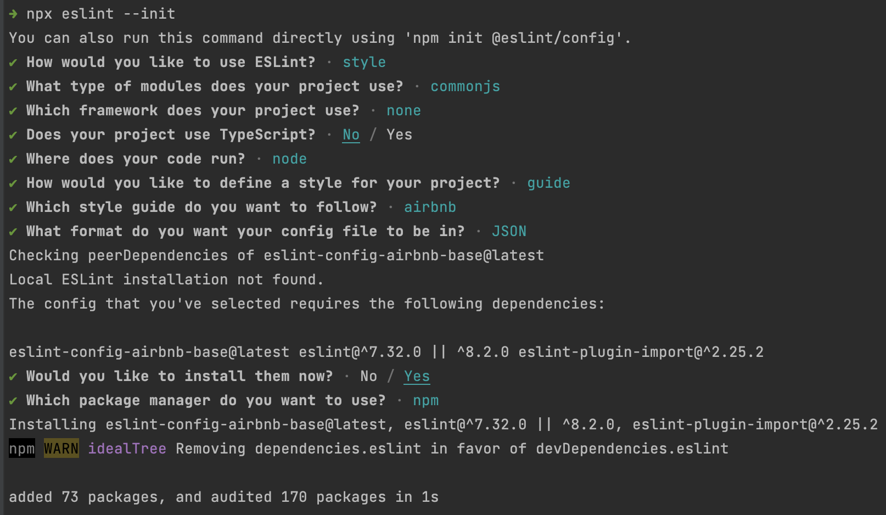

HOME TASK 
1. Create new branch in your empty repository and call it e.g. /unit_tests
2. Copy attached code  to your repository and cover it by unit tests (create a file with the provided content) with unit tests using Mocha. 
3. Add mochawesome as a reporter. 
4. Add code coverage analyzer c8. 
5. Setup eslint (using eslint init) with a popular style guide. 
NOTE:
1.We recommend to use Common JS modules 
2.It is not required to Install / Setup Husky
3.Please use the following options while configuring ESLint




Create .eslintrc.json with the following content


```javascript
// .eslintrc.json{
{   
"env": {
        "commonjs": true,
        "es2021": true,
        "node": true
    },
    "extends": "airbnb-base",
    "parserOptions": {
        "ecmaVersion": "latest"
    },
    "rules": {
        "class-methods-use-this": "off",
        "arrow-parens": "off",
        "prefer-arrow-callback": "off",
        "func-names": "off",
        "object-curly-newline": "off"
    }
}

```

ACCEPTANCE CRITERIA 
1. Code coverage is 100% for everything. 
2. Code follows a popular style guide. 
3. The package.json file should contain the following scripts: 
- test – should run your tests. 
- coverage – should run code coverage analysis. 
- lint – should run eslint. (Can be run with the --fix flag) 
